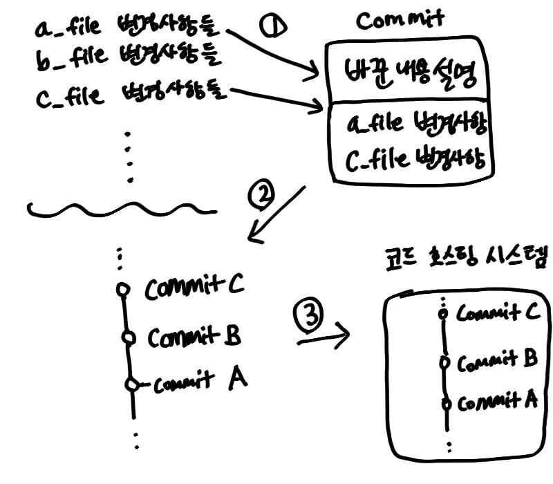
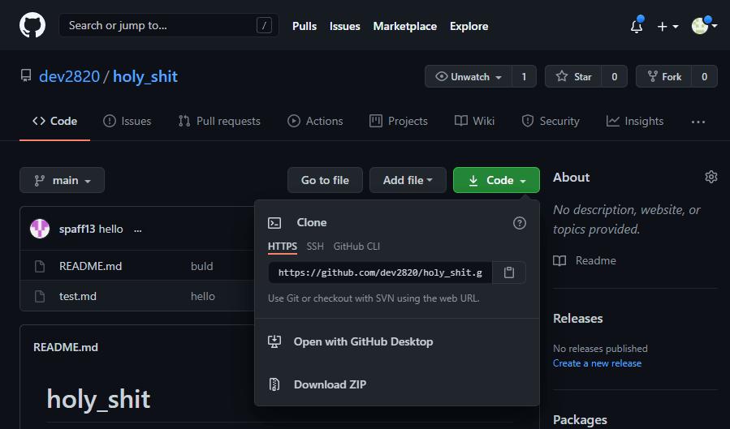

+++
title= "아주 기초적인 git"
date= 2021-03-20T11:23:58+09:00
categories= ["projects"]
tags= ["프로젝트","게임","똥피하기","로그인폼","git"]
subcategories = ["holy_shit"]
cover = ""
icon = "projects/project-icon.png"
draft= false
+++

페이지들을 만들기 전, 프로젝트를 시작하기 위한 아주아주아주 간단한 git 강의입니다. 오타, 오류 지적 환영입니다.

## Git?

git은 **형성 관리 시스템**중 하나입니다. 소스 코드 버전 관리를 위해 쓰는 툴이고, 다음의 것들을 할 수 있습니다.

- 소스 코드 되돌리기
- 소스 코드 병합
- 코드 호스팅 시스템에 소스 코드 받아오고 올리기
- 코드 분기(branch)를 통한 소스 코드 다양화

물론, 자세히 들어가면 더 많고 유용한 기능들이 있지만, 기초적인 것만 다루는 글이니 이 정도만 설명하겠습니다.

## Github?

코드 호스팅 사이트 중 하나입니다. 무료로 소스 코드를 올리고 다운받을 수 있습니다.

## 시작하기에 앞서

시작하기에 앞서 간단한 git의 동작 원리를 알아보겠습니다.



### 1. staging

git은 파일 별로 바뀐 점들을 감지합니다. a_file.txt는 1번 줄이 바뀌었고, 3번 줄이 삭제됐고, 10번 줄이 새로 생겼어! 이런 식이죠.

유저는 이 변경된 파일들을 하나로 묶습니다. 한 박스에 담는다고 표현할게요. 한 박스에 파일들을 담는 행위를 **staging**이라고 하고, 담긴 파일들을 **staged**됐다고 합니다.


### 2. commit

다음으로 유저는 묶은 파일에 메시지를 달아줍니다. 왜 그 코드들을 바꿨는지, 전체적으로 뭐가 바뀐 건지에 대한 설명을 달아주는데, 이 메시지는 자세히 달아줄수록 좋습니다. 특히 팀 프로젝트를 진행하게 되면 메시지의 형식을 어느 정도 정해놓으면 좋습니다.

메시지 EX)
```bash
dev2820 - 프로그램이 멈추는 버그가 일어나던 issue를 해결했다. a_file과 c_file의 변수를 잘못 선언해 무한루프를 돌고 있었고, 변수명을 새로 지어주어 해결했다.
```

메시지까지 써 붙여서 박스를 닫고 테이프로 입구를 막는데, 이 박스를 **commit**이라고 합니다. 박스를 채우고 설명을 달고 밀봉하면 하나의 commit이 생기는 거죠.

유저의 PC를 집이라고 하면 유저의 집에 commit이라는 박스가 쌓이기 시작합니다. 박스들을 마구섞어 보관하게 되면 관리가 안되겠죠? git은 이 박스들을 시간순으로 나열해 줄로 연결합니다. 이 나열된 박스들(commits)를 **branch**라고 합니다.

### 3. push

마지막으로 유저는 이 branch를 분실해도 복구할 수 있게 코드 호스팅 시스템에게 복사를 의뢰합니다. github에 올린다고 할께요. github는 유저가 맡긴 branch를 복사해 진열장에 보관합니다. 유저의 권한으로 다른사람들이 이 branch를 볼 수도, 복사해 갈 수도, 변경하게 할 수도 있습니다. github에 코드가 저장되는 공간을 **repository**라고 하며, 이 repository는 원래 가지고 있던 branch와 유저가 올린 branch를 비교해 기존의 branch를 갱신합니다.

이렇게 git의 시스템을 간략하게 비유해봤습니다. 어디까지 간략화 되어있으며 더 자세한 설명은 git 공식홈페이지를 참고하세요

## 시작하기

먼저 git을 다운받아야겠죠? 아래 링크에서 git을 다운받습니다.  

git 다운로드

먼저, 프로젝트를 시작하는 방법은 두 가지 방법이 있습니다. 

- 빈 디렉토리부터 시작한다.
- 다른 사람이 짜놓은 프로젝트를 다운받는다.
### new repository

github 페이지 우측 상단에 `+` 버튼을 클릭하면 새로운 저장소 생성하기가 나옵니다.


저장소 이름을 입력하고 대충 넘기면 저장소가 만들어집니다.
그럼 다음과 같은 코드를 입력하라고 나옵니다.

```bash
git init
git add README.md
git commit -m "first commit"
git branch -M main
git remote add origin https://github.com/dev2820/holy_shit.git
git push -u origin main
```
### git init
`git init`명령어는 git을 시작하겠다는 명령어 입니다. 프로젝트를 만드려는 디렉토리에서 bash shell을 켜고 `git init`을 입력하면 git은 `.git`이라는 디렉토리를 만듦니다. 여기에 코드관리 내역들, 사용자 정보 등등이 저장됩니다.
```bash
git init
```
git은 `.git`디렉토리가 있는 디렉토리의 파일들의 변경된 점을 감지합니다.
이제 저장소에 올릴 branch를 만들어야하기 때문에 최초의 파일을 만들어줘야합니다. 보통 `README.md`가 국룰이죠. README.md파일을 만들고 대충 아무내용을 채워줍니다.
```bash
echo "#프로젝트이름" >> README.md
```

### git add
이제 만들어진 README.md파일을 박스에 담아야합니다.(staging)
staging명령은 다음과 같습니다.

```bash
# git add [파일이름]
git add README.md

# 변경된 파일 전체를 staging하는 명령어
# git add .
```

### git commit 
이제 박스를 닫고 메세지를 입력해줘야합니다.

```bash
# git commit -m "[메세지]"
git commit -m "first commit"
```

드디어 이 프로젝트의 최초의 branch가 탄생합니다.
이제 이걸 저장소에 보내 사본을 저장해야겠죠?

### git branch 
```bash
git branch -M main
```
위 명령은 master 브랜치의 이름을 main으로 바꾸는 명령입니다.

`git branch`명령어는 새로운 branch를 만드는 명령입니다. 우리가 만든 최초의 branch를 `main branch`라고 합니다. 이 branch말고 다른 branch를 만들고 싶으면 다음과 같이 입력합니다.
```bash
# git branch [branch 이름]
git branch sub_branch
```

branch list를 보고싶다면 `git branch`를 입력하면 됩니다.

main branch는 원격저장소에 origin이란 이름으로 저장할 branch이고 다른 branch들은 main branch의 만약에~ 버전입니다. 즉 실험적인 코드들을 적용해 볼 수 있는 branch이지요.

```bash
# git checkout [branch 이름]
git checkout sub_branch
```
다른 branch로 이동하는 명령입니다. branch를 옮겨 새로운 코드를 작성하고 commit을 만들어 상태를 저장한 뒤, 다시 main branch로 돌아오면 새 branch에서 작성한 코드들은 main branch에 적용되지 않습니다.

### git merge
branch끼리 합치는 명령입니다. 합치고자 하는 branch를 합칠 branch에서 merge 해줍니다.

```bash
# 합칠 branch로 이동
git checkout main

# 병합
git merge sub_branch
```

이때 기존의 코드와 겹치는 부분이 생겨서 git이 merge를 중단하고 유저에게 어떤 코드를 합칠 지 물어보는 상황이 생깁니다. 이를 병합충돌이라고 하는데 코드가 아래와 같이 변경됩니다.

```bash
<<<<<<< HEAD
a=b;
======= 
a=c;
>>>>>>> sub_branch
```

위 코드에서 한쪽 코드를 선택해 남기고 나머지는 지웁니다. 다시 코드가 변경되었으니 병합충돌이 일어난 파일은 `add` 해주고 `commit`해주면 멈췄던 merge를 이어나갑니다.

### git remote
원격저장소에 commit들을 업로드할 때 어디로 branch를 보낼지 주소를 알아야합니다.



초록색 code버튼을 누르면 나오는 HTTPS 주소가 이 프로젝트 저장소의 주소입니다.
그리고 repository의 주소를 저장하는 명령을 입력합니다.

```bash
# origin repository 추가
git remote add origin https://github.com/dev2820/holy_shit.git

# 현재 등록된 repository의 list
git remote -v
```
`git remote add`명령은 저장소를 등록하는 명령어 입니다. origin이라는 이름으로 등록했습니다. 

### git push
`push`가 git의 branch를 repository로 전송시키는 명령입니다.

```bash
# git push [repository] [branch]
git push origin main

# -u 옵션을 주면 main branch의 upstream을 origin으로 설정한다
```
main branch를 origin으로 업로드 했습니다. `-u`는 upstream을 설정하는 명령인데 upstream이란 로컬 branch가 업로드 되는 branch를 말합니다. 따라서 upstream을 설정해주면 앞으로는 repository와 branch를 입력해주지 않아도 main은 origin으로 branch를 업로드하게 됩니다.

### git config
```bash
git config --global user.name "[사용자 이름]"
git config --global user.email [이메일]
```

위 코드를 입력하라고 뜨는 사람들이 있을텐데, 이건 유저정보를 git에 등록하는 겁니다. 등록된 정보는 git이 commit을 저장할 때 사용합니다.

### git fetch, git pull
```bash
# 새로운 commit 가져오기
git fetch

# 새로운 commit을 가져와 병합하기
git pull
```

`fetch`, `pull`은 원격 저장소로부터 로컬 저장소에는 없는 commit들을 받아오는 명령입니다. `fetch`는 commit을 받아만 옵니다. 현재 branch가 FETCH_HEAD로 바뀌며, merge를 진행해줘야 내 main branch가 갱신됩니다. 

`pull`은 `fetch`+`merge`라 생각하면 됩니다. 자동으로 merge까지 진행해줘 main branch를 최신으로 갱신해줍니다. 

## 다른 사람의 프로젝트를 받는 경우
다른 사람의 프로젝트 코드를 내 프로젝트에 받아오는 방법도 있습니다. 다른 사람의 원격저장소에 내 원격저장소를 연결하는 경우를 **forking**, 원격저장소에서 로컬 저장소로 소스코드를 복사하는 경우를 **cloning**이라고 합니다. 

```bash
git clone https://github.com/dev2820/holy_shit.git
```

이상으로 아주 기초적인 git을 마치겠습니다. 추후에 커밋을 변경 및 취소하는 명령어가(revert,rebase,reset 등) 필요해지면 그때 git에 대해 더 자세히 알아보겠습니다.
