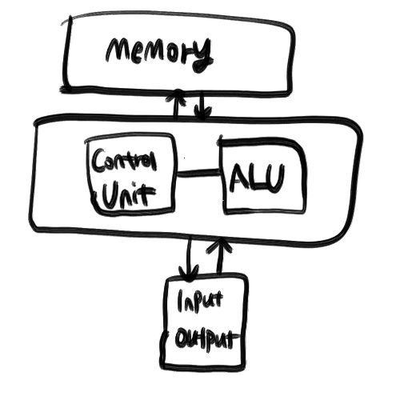

+++
title = "프로그래밍언어(1)"
date = 2021-03-06T21:33:27+09:00
categories= ["computer_science"]
tags= ["프로그래밍언어","PL","공부"]
subcategories = ["programming_language"]
cover = ""
icon = "computer_science/computer_science_icon.png"
draft = false
+++

이 글은 ROBERT W.SEBESTA의 **concepts of programming languages (11th, global edition)**에 의거하여 작성된 글이며, 필자가 번역 및 공부하면서 정리하는 글이라 오류가 있을 수 있습니다. 오류,오타 지적은 환영입니다.

## 프로그래밍 언어들의 개념을 공부해야하는 이유
컴퓨터 과학의 여러 중요한 개념들 중에서도 프로그래밍 언어를 공부하면 다음과 같은 이점을 얻을 수 있습니다. 

- 표현력의 증가(같은 코드를 다양한 언어로 짤 수 있게 된다.)
- 프로그램에 적합한 언어를 선택하는데 필요한 지식이 늘어난다.
- 새로운 언어를 배우기 쉬워진다.
- 프로그램 구현의 중요성을 더 잘 이해하게 된다.
- 이미 아는 언어도 더 잘 사용할 수 있게 된다.
- 프로그래밍 실력이 전반적으로 향상된다.

음... 같은 말을 반복하는거 같은데 어쨌든 PL(programming language)을 공부하면 프로그래밍을 더 잘하게 된다는 뜻 같습니다. 가장 큰 장점은 각 언어의 장단점을 알게되어 **특정 프로그램을 구현할 때 어떤 언어를 선택하면 좋은지** 알게된다는 점인것 같네요.

## 언어 평가 기준
언어를 평가하는 기준은 크게 3가지가 있고 이 기준에 영향을 주는 요인들이 있습니다.

- 가독성이 좋은가?
    - 언어가 간단한가?
    - 직교성(orthogonality)를 가지는가?
    - 데이터 타입(int,double 등)을 제공하는가?
    - 문법이 잘 설계되었는가?
- 코드 작성이 편리한가?
    - 추상화 개념(function,class)을 제공하는가?
    - 코드의 표현성이 좋은가?
- 코드의 신뢰도가 높은가?
    - 타입 체크를 진행하는가?
    - 예외 처리를 위한 문법을 제공하는가?
    - 하나의 데이터에 여러 이름으로 접근이 가능한가?

### 가독성
1970년 이전엔 **소프트웨어 개발 = 코딩** 으로 여겨졌습니다. 따라서 초기의 프로그래밍 언어들은 코드의 가독성보다 효율을 중시한다는 특징을 가집니다. 언어는 실제 컴퓨터에서 코드가 작동하는 방식과 비슷하게 구성되었습니다.(어셈블리어등을 생각하면 되겠죠?) 

그러나 1970년에 들어서면서 소프트웨어 생명주기(software life-cycle)이라는 개념이 등장합니다. 즉, 사람들은 단순히 코드만 잘 짜면 되는게 아니라 코드를 잘 관리해야 개발비용(cost)가 줄어든다는 사실을 알았고, 코드를 잘 관리하려면 가독성이 좋아야 한다는 사실 또한 부각됩니다. 좋은 프로그램과 프로그래밍 언어의 기준이 가독성이 된것입니다. 이는 프로그래밍 언어가 기계중심에서 인간 중심이 되게 하는 반환점이 됩니다. 

#### 전반적인 간결성
코드의 간결함은 가독성에 큰 영향을 줍니다. 100줄짜리 코드와 10줄짜리 코드가 같은 기능을 수행한다면 당연히 10줄짜리 코드가 좋겠지요? 

#### 직교성(Orthogonality)
프로그래밍 언어에서 직교성을 가진다는 말은 상대적으로 작은 초기 구조들을 엮어 더 큰 데이터 구조를 만들고 제어할 수 있다는 뜻입니다. 예를 들어, 한 언어가 데이터 타입(int,float,double,character)와 배열,포인터를 지원한다고 합시다. 우리는 char형 2차원 배열을 선언해(작은 초기 구조를 엮어) 사람의 이름을 저장하는 list(더 큰 데이터구조)를 만들고 데이터를 읽거나 변경할 수 있습니다. 

직교성을 가지는 언어는 언어의 간결성과 직접적인 관련이 있습니다. 만약 한 언어가 영어와 문법이 같다면 코드를 짜는 사람이 알아야 하는 문법이 아주 많고 다양한 예외를 가지게 되겠죠? 

#### 데이터 타입
데이터 타입의 존재여부는 가독성에 큰 영향을 줍니다. 예를 들어 Boolean 타입이 없어서 숫자로 true,false 여부를 표현해야 한다고 합시다. (C를 생각하면 되겠죠?)

```
timeOut = 1
```
이 코드만 읽은 사람은 timeOut이 1을 저장하고 있다는 의미인지, true를 저장하고 있다는 의미인지 알 수 없습니다. 하지만 Boolean타입이 있다면
```
timeOut = true
```
다르게 해석할 여지는 없겠죠?

#### 문법 설계
언어를 구성하는 요소들의 형태와 의미도 프로그램의 가독성에 큰 영향을 줍니다.
문법이 의미하는 바가 명확해야 코드의 가독성이 높아집니다. (ex. `while`,`class`,`for` 등)
그리고 문법에 사용되는 단어가 변수이름으로 쓸 수 있으면 문제가 됩니다. 예를 들어 Fortran 95에서는 `Do`와 `End`를 변수 이름으로 사용할 수 있었습니다. 따라서 이러한 단어의 등장은 의미가 있을 수도, 없을 수도 있었습니다.

### 작문성(Writability)
뭐라고 번역해야 좋을지 몰라서 작문성이라고 번역을 했는데, 더 좋은 표현을 댓글로 달아주시면 감사하겠습니다.

작문성은 그 언어가 얼마나 사용하기 쉬운지를 알려준다. 대부분의 언어에서 가독성에 영향을 주는 특성은 작문성에도 영향을 줍니다. 예를 들어, Visual BASIC은 코드작성이 C에 비해 극도로 쉽습니다. 바로 Visual BASIC은 GUI를 제공하기 때문이죠.  

#### 간결성과 직교성
간결한 문법과 적절한 직교성을 제공하면 작문성이 좋아집니다. 대부분의 언어가 특정 배열에 접근하는데 `[]`를 사용하죠. 이는 간결해서 코드를 작성할때도, 코드를 읽을 때에도 좋습니다.

#### 표현성
코드의 표현성이 좋아 코드를 쓰는 사람이 편하면 좋겠죠? 예를 들면 C는 `count = count + 1`을 `count++`로 표현할 수 있습니다.

### 신뢰도
쓰여진 코드를 믿을 수 있는가?(신뢰할만한가?)도 중요합니다. 코드에 안전장치가 없어 걷잡을 수 없는 에러를 일으키면 너무 슬프겠죠?

#### 타입 체크
타입체크는 단순히 계산하려는 두 변수의 타입이 다르면 에러를 일으킵니다. C언어에서 포인터와 int형 변수를 더하면 컴파일러가 에러를 띄웁니다. 컴파일러가 이러한 에러를 잡지 못하고 run-time중에 에러가 일어나버리면 더 큰일로 번질 수 있기 때문에 타입 체크는 언어의 신뢰도에 영향을 줍니다. javascript와 typescript의 차이를 생각하면 되겠네요.

#### 예외 처리
컴파일러가 잡을 수 없는 run-time에 일어나는 오류들을 잡는 예외 처리 장치들을 제공하는 지도 신뢰도에 영향을 줍니다. `try catch`가 왜 유용하며 필요한지는 다 아실겁니다.

#### aliasing
같은 메모리에 접근할 수 있는 다양한 변수를 제공하는 것은 일반적으로 위험하다고 여겨집니다.
대부분의 프로그래밍 언어는 같은 메모리에 접근할 수 있는 방법을 여럿 제시합니다.(C는 여러개의 포인터가 같은 메모리를 가리키도록 할 수 있죠) 같은 메모리에 접근할 수 있는 방법이 여러개이기 때문에 프로그래머는 어떤 변수가 어떤 메모리에 접근하는지 잘 기억할 필요가 있습니다. 몇몇 추상화기능이 없는 언어들은 이를 극복하기 위해 aliasing을 사용하지만, 다른 언어들은 aliasing을 제한해 신뢰도를 높입니다.(Java의 경우 포인터의 개념이 아에 없죠)

#### 가독성과 작문성
가독성과 작문성도 신뢰도에 영향을 줍니다. 잘못 읽고 쓰는 일이 줄어들면 코드가 에러를 일으킬 확률도 줄어드니까요.

### Cost
프로그래밍 언어는 다양한 cost를 발생시킵니다.
- 언어 습득에 드는 비용
- 언어 사용에 드는 비용
- 컴파일에 드는 비용
- 실행에 드는 비용

너무 어려운 언어나 코드 작성이 오래걸리는 언어, 컴파일이 오래걸리거나 성능이 안좋은 언어는 당연 high cost가 발생하겠죠

## 언어 설계에 영향을 주는 점들
언어 설계에 영향을 주는 요인은 다음과 같은 요인이 있습니다.
- 컴퓨터 구조
- 프로그래밍 설계 방법론

과거엔 **Von Neumann 아키텍처**가 유명했고 컴퓨터는 이 아키텍처대로 만들어졌습니다. Von Neumann 아키텍처 컴퓨터는 **fetch-execute cycle**이라 불리는 프로세스를 가지는데, 과거의 프로그래밍 언어는 이 구조를 반영하고 있었습니다. 



(폰 노이만 아키텍쳐, memory에 올라간 명령을 control unit이 읽어 ALU를 통해 계산하고 다시 메모리에 저장하는 식의 아키텍처이다)

프로그램은 명령들이 메모리에 올라가고 명령을 순차적으로 또는 Jump 해가며 명령을 수행했기 때문에 이러한 구조가 반영된 언어를 명령형 언어라고 했습니다. 

```f90
program average

  ! Read in some numbers and take the average
  ! As written, if there are no data points, an average of zero is returned
  ! While this may not be desired behavior, it keeps this example simple

  implicit none

  real, dimension(:), allocatable :: points
  integer                         :: number_of_points
  real                            :: average_points=0., positive_average=0., negative_average=0.

  write (*,*) "Input number of points to average:"
  read  (*,*) number_of_points

  allocate (points(number_of_points))

  write (*,*) "Enter the points to average:"
  read  (*,*) points

  ! Take the average by summing points and dividing by number_of_points
  if (number_of_points > 0) average_points = sum(points) / number_of_points

  ! Now form average over positive and negative points only
  if (count(points > 0.) > 0) then
     positive_average = sum(points, points > 0.) / count(points > 0.)
  end if

  if (count(points < 0.) > 0) then
     negative_average = sum(points, points < 0.) / count(points < 0.)
  end if

  deallocate (points)

  ! Print result to terminal
  write (*,'(a,g12.4)') 'Average = ', average_points
  write (*,'(a,g12.4)') 'Average of positive points = ', positive_average
  write (*,'(a,g12.4)') 'Average of negative points = ', negative_average

  end program average
```

위키백과에 올라와 있는 fortran 90의 코드입니다. 포트란이 대표적인 명령형 언어인데 보이다싶이 거의 어셈블리어와 닮아있습니다. 실제로 컴퓨터의 Control Unit이 읽는 명령도 위 코드들과 비슷하게 명령, 메모리 (메모리) 순으로 이루어집니다. (자세한 내용은 컴퓨터구조를 공부해보세요)

명령형 언어가 줄줄이 나오던 1960후반, 새로운 프로그램 설계 기법이 등장하게 됩니다. 프로그램을 명령들의 실행들로 보는 것이 아닌, 객체들의 상호작용으로 보는 새로운 관점의 언어가 나오는데 이게 바로 **객체지향언어**입니다. 객체지향언어는 Smalltalk(Goldberg and Robson, 1989)라는 실험적인 언어를 시작으로 처음 만들어졌는데, 이는 나중에 Java, C++, C#등의 주류 언어로 발전하게 되죠. 

최근에 들어선 함수형 언어가 새로운 패러다임을 불러일으키고 있는데 이건 없는 내용이라 패스하겠습니다.

## 프로그래밍 언어의 종류

프로그래밍 언어는 크게 네 가지로 분류됩니다: 명령형, 함수형, 논리형 그리고 객체지향형
명령형 언어는 알골, 포트란, 그리고 C 정도가 있고 함수형 언어는 하스켈, 스칼라 등이 있습니다. 논리형 언어는 머큐리, 앨리스 등이 있다는데... 저는 처음 듣네요. 그리고 객체지향형 언어는 Java, C++등 잘 알려진 언어들이 있죠.

그리고 최근(책이 쓰여진 시점 기준) 새로운 종류의 언어가 만들어졌는데 바로 HTML(markup programming hybrid languages)입니다. 말그대로 마크업을 만드는 언어죠. 